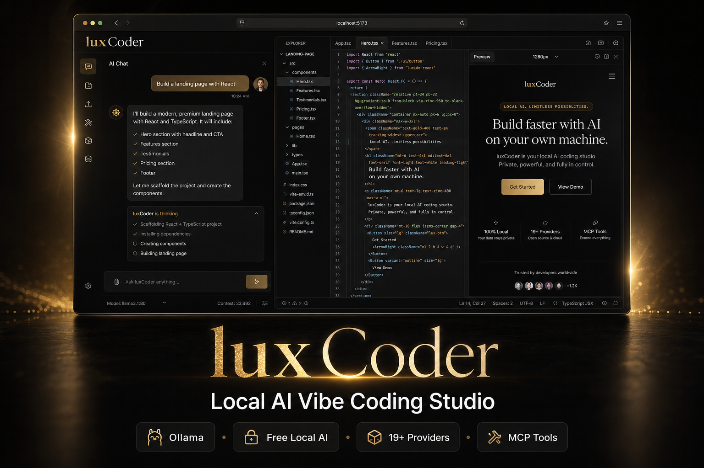

<p align="center">
  
  
  
  
  
</p>

# luxCoder

**Local-first AI vibe coding studio** — build full-stack apps in your browser with free local models (Ollama), cloud APIs, or both. A [bolt.diy](https://github.com/stackblitz-labs/bolt.diy) fork rebranded and tuned for **The Lux Empire** by [iboss21/LUXCode](https://github.com/iboss21/LUXCode).

[](https://github.com/iboss21/LUXCode)

> Chat on the left. Code, terminal, and live preview on the right. Pick **Ollama** for $0 API spend, or plug in OpenAI, Anthropic, Hugging Face, and 19+ other providers.

---

## What is luxCoder?

luxCoder is an **open-source AI coding assistant** that runs in **Chrome, Edge, or Firefox** on your PC. Describe what you want — a landing page, SaaS dashboard, API, mobile app scaffold — and the AI generates files, runs commands in an integrated terminal, and shows a **live preview** in the same window.

Think **Cursor / Bolt / v0**, but:

| | luxCoder |
|---|----------|
| **Cost** | Free with [Ollama](https://ollama.com) — no API key required |
| **Privacy** | Local models keep code on your machine |
| **Stack** | React, Remix, Vite, WebContainer — full-stack in the browser |
| **Extras** | MCP tools, image prompts, prompt enhance, deploy to Netlify/Vercel |

---

## Features

- **AI chat + code generation** — multi-file projects from natural language
- **Free local AI** — Ollama, LM Studio, OpenAI-compatible endpoints
- **19+ cloud providers** — OpenAI, Anthropic, Google, Groq, Hugging Face, DeepSeek, and more
- **One-click model downloads** — Settings → Local → Ollama → Download recommended coding models
- **MCP tools** — fetch URLs, docs search, memory, multi-step agent calls
- **Enhance prompt** — polish your request before sending
- **Images & code paste** — attach screenshots; multi-line code auto-wraps in fences
- **Integrated terminal & preview** — run npm, see output instantly
- **Git import/export** — clone repos, export chats, deploy builds
- **Dark lux gold theme** — `#080808` / `#c9a96e` The Lux aesthetic

---

## Quick start (Windows — recommended)

**Requirements:** [Node.js LTS](https://nodejs.org/) · [pnpm](https://pnpm.io/) (optional) · [Ollama](https://ollama.com/download) (for free local AI)

1. Clone and install:

   ```powershell
   git clone https://github.com/iboss21/LUXCode.git
   cd LUXCode
   pnpm install
   ```

2. **Double-click** `start-luxcode.bat` — or run:

   ```powershell
   pnpm run local:windows
   ```

3. Browser opens at **http://127.0.0.1:5173**

4. **Settings → Providers → Local → Ollama** → enable → **Download** `qwen2.5-coder:14b`

5. In chat, select **Ollama** + your model → start building.

Optional one-shot model install:

```powershell
pnpm run setup:models
```

Full guide: **[Windows local + free AI](./docs/windows-local-free-ai.md)**

---

## Quick start (macOS / Linux)

```bash
git clone https://github.com/iboss21/LUXCode.git
cd LUXCode
pnpm install
cp .env.free-local.example .env.local   # optional Ollama defaults
pnpm run dev
```

Open **http://127.0.0.1:5173** → enable Ollama in Settings → pick a model.

---

## MCP tools (extra agent powers)

Click the **MCP** icon in the chat bar → **Enable** on **Recommended (free)** → **Check availability**.

Adds web fetch, documentation search, and memory so the AI can call tools during chat (similar to Cursor agent mode). Details in [Windows local guide](./docs/windows-local-free-ai.md#mcp-tools-extra-powers--like-cursor-tools).

---

## Configuration

| Method | Use case |
|--------|----------|
| **UI (Settings)** | Toggle providers, API keys, Ollama models, MCP presets |
| **`.env.local`** | Server-side keys — copy from `.env.free-local.example` |

```env
# Minimum for Ollama-only
OLLAMA_API_BASE_URL=http://127.0.0.1:11434
```

Cloud keys (optional): `OPENAI_API_KEY`, `ANTHROPIC_API_KEY`, `HuggingFace_API_KEY`, etc.

Provider setup: **[API Keys Guide](./docs/guides/api-keys.md)**

---

## Scripts

| Command | Description |
|---------|-------------|
| `pnpm run dev` | Development server |
| `pnpm run local:windows` | Windows launcher (env, deps, browser) |
| `pnpm run stop:dev` | Stop dev servers on ports 5173–5175 |
| `pnpm run setup:models` | Pull recommended Ollama coding models |
| `pnpm run build` | Production build |
| `pnpm run lint` / `lint:fix` | ESLint / auto-fix |
| `pnpm run docker:run` | Docker container on port 5173 |

See [package.json](./package.json) for the full list (Electron, Cloudflare deploy, etc.).

---

## Documentation

| Guide | Description |
|-------|-------------|
| [Documentation hub](./docs/README.md) | All docs |
| [Windows local + free AI](./docs/windows-local-free-ai.md) | Ollama, HF, daily workflow |
| [Getting started](./docs/guides/getting-started.md) | First project walkthrough |
| [API keys](./docs/guides/api-keys.md) | All 19+ providers |
| [Deployment](./docs/deployment/README.md) | Docker, Coolify, VPS |
| [FAQ](./docs/FAQ.md) | Common issues & model picks |

---

## Recommended local models (12 GB GPU)

| Model | Role |
|-------|------|
| `qwen2.5-coder:14b` | **Default** — best balance for vibe coding |
| `qwen2.5-coder:7b` | Faster, lighter |
| `deepseek-coder-v2:16b` | Hard refactors / multi-file logic |

---

## Support & community

- **Script support (buyers / install help):** [Dev Discord](https://discord.gg/ZHMKVYyhBa)
- **Brand:** [wolves.land](https://wolves.land)
- **Issues:** [GitHub Issues](https://github.com/iboss21/LUXCode/issues)

---

## Credits & upstream

luxCoder is based on **[bolt.diy](https://github.com/stackblitz-labs/bolt.diy)** (MIT) — the open-source Bolt.new stack. Original project by [Cole Medin](https://www.youtube.com/@ColeMedin) and the bolt.diy community.

- Upstream docs: [bolt.diy Docs](https://stackblitz-labs.github.io/bolt.diy/)
- Contributing: [Contributing Guide](./docs/CONTRIBUTING.md)

---

## License

**Source code:** MIT (see upstream bolt.diy).

**WebContainers API:** Production commercial use may require a [WebContainer license](https://webcontainers.io/enterprise) from StackBlitz. Prototypes and personal projects are typically fine under their terms — verify for your use case.
